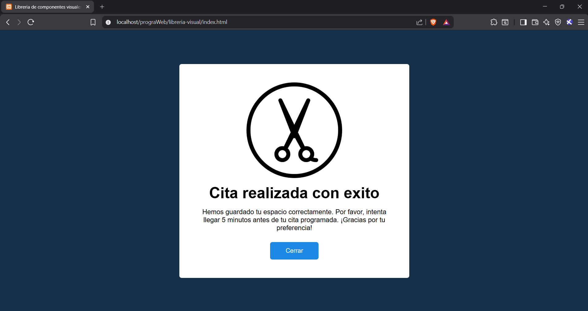

# Utilería JS - Librería de Componente Visual de tipo Modal

Una librería desarrollada con **JavaScript y CSS** que permite mostrar informacion sobre una accion realizada en el sistema al dar un click. Su propósito es reducir el tiempo de desarrollo de una pagina web y reutilizar el codigo las veces que sea necesario.

---

# Estructura del proyecto

```
/libreria-visual
│── README.md
│── index.html
│── login.html
│
├── css
│   └── componente.css
│   └── index.css
│
├── js
│   └── componente.js
│
└── img
│   └── tijeras.png    
```

---

# Instalación

Descarga el archivo **componente.css** y agrégalo antes de cerrar la etiqueta `body`, el archivo **componente.js** debe ir antes de terminar la etiqueta `body`.

```html

<link rel="stylesheet" href="css/componente.css">
<script src="js/componente.js"></script>
```

O si el archivo se encuentra en la misma carpeta:

```html
<link rel="stylesheet" href="componente.css">
<script src="utileria.js"></script>
```

---

# Descripcion del codigo CSS

## 1. .modal

Abarca toda la pantalla y se establece el color y posicionamiento del fondo del modal (parte sombreada). Se inicializa como invisible y sin interaccion con el mouse. Esta clase se recomienda que se le asigne a un <section>

### Codigo

```css
.modal {
    position: fixed;
    top: 0;
    left: 0;
    right: 0;
    bottom: 0;
    background-color: #111111bd;
    display: flex;
    opacity: 0;
    pointer-events: none;
    z-index: 9999; 
    overflow-y: auto; 
}
```
---

## 2. .modal--ver

Se encarga de hacer visible el modal y que pueda recibir interaccion del mouse.

### Codigo

```css
.modal--ver {
    opacity: 1;
    pointer-events: unset;
}
```

---

## 3. .modal-contenedor

Es la parte que muestra la informacion, se recomienda que esta clase se le de a un <div>.

### Codigo

```css
.modal-contenedor {
    margin: auto;
    width: 90%;
    background-color: #fff;
    max-width: 600px;
    min-height: auto; 
    border-radius: 6px;
    padding: 2em 1.5em; 
    display: grid;
    gap: 1em;
    place-items: center;
    grid-auto-columns: 100%;
    box-sizing: border-box; 
}
```
---

## 4. .modal-titulo

El mensaje principal que se mostrara en el modal. Se recomienda agregar esta clase a un <h2>.

### Codigo

```css
.modal-titulo {
    font-size: clamp(1.5rem, 5vw, 2.5rem); 
    text-align: center;
}
```
---

## 5. .modal-texto

El mensaje complementario que sigue despues del titulo. Se recomienda agregar esta clase a <p>.

### Codigo

```css
.modal-texto {
    margin-bottom: 10px;   
    text-align: center;
    font-size: clamp(0.95rem, 2vw, 1.1rem); 
}
```
---

## 6. .modal-image

Imagen que puede mostrar en el modal. Debe estar en una etiqueta <image>.

### Codigo

```css
.modal-image {
    width: 100%;
    max-width: 180px; 
    height: auto;
    object-fit: contain;
}
```

---

## 7. .modal-cerrar y .modal-cerrar:hover

Es la parte en la que se podra cerrar el modal; La clase con hover permite que el color cambie al momento de pasar el cursor sobre este. Se recomienda usar en <a> o <button>

### Codigo

```css
.modal-cerrar {
    text-decoration: none;
    color: #fff;
    background-color: #1e88e5;
    padding: 0.8em 2.5em; 
    border: 1px solid #1e88e5; 
    border-radius: 6px;
    display: inline-block;
    font-weight: 300;
    transition: background-color .3s, color .3s;
    text-align: center;
    font-size: clamp(0.9rem, 2vw, 1rem);
}

.modal-cerrar:hover {
    color: #1e88e5;
    background-color: #fff;
}

```
---

# Capturas de pantalla

---

## Modal


---

# Video demostrativo

https://drive.google.com/file/d/1RvQioZC8xlm7sj_GDw06DjQaz0D-WDGm/view?usp=sharing

---

# Tecnologías utilizadas

- HTML5
- CSS3
- JavaScript

---

# Autor

**Nombre:** Jose Daniel Cruz Barrera

**Materia:** Programación Web

**Proyecto:** Librería de componete visual con js y css.

**Fecha:** 05/07/2026

